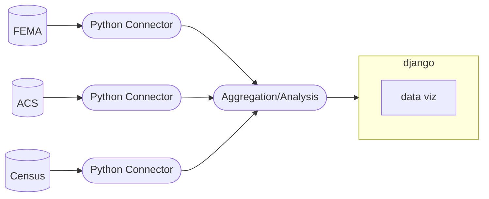

# (la)Monty Python CAPP30122 Final Project
### <i>Team Members: Ali, Aditya, Wesley & Zander</i>

## Project Description
Measure impact of various demographic, economic, and/or political features on natural disaster recovery outcomes in the U.S. We plan to use data from several government sources, including the Census Bureau, Bureau of Labor Statistics, and FEMA to capture demographic, economic, and natural disaster measures. We would also like to use satellite image data from pre- and post-disaster to create a basic measure of structural recovery and its geospatial distribution (dream big!). For our interface, we’d like to create an interactive dashboard (possibly in Django) that allows a user to explore how different measures relate with recovery outcomes through maps/charts (folium, leaflet, plotly). The front end will use data from live API connections with various data sources.

## Data Sources
- <a href='https://www.fema.gov/about/openfema/data-sets#disaster'>FEMA</a>
- <a href='https://www.census.gov/programs-surveys/acs/data/data-via-api.html'>American Community Survey</a>

## Project Timeline
[insert screenshot from Asana]

## App Diagram

<i>This diagram was created with <a href='https://mermaid-js.github.io/mermaid/#/'>Mermaid-js</a>
