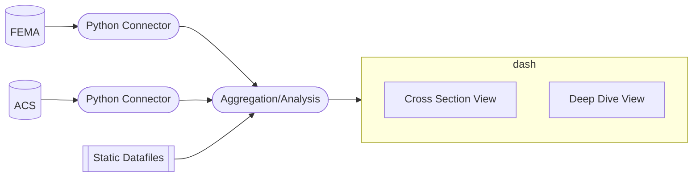

# Project: Nautral Disaster Aid and Demographics
## Team: (la)Monty Python 
## Team Members: Aditya, Ali, Wes and Zander
## IDs: , , , and 12273788

### Project Overview

### Software Structure

The software consists of two abstract class connections to two separate APIs on the backend, a data integration and analysis middle layer, and a Plotly Dash frontend application. The frontend consists of two views:
- Cross Section: user can explore the relationship between demographics and FEMA aid provided at the county-disaster level, exploring how different county demographic factors are related with aid levels for a given disaster or disasters  
- Deep Dive: user can view specific statistical relationships between

### Code Responsibilities
#### Everyone
- Code reviews  
- Collaborative code troubleshooting  

#### Aditya
- Project management
- Dash frontend, deep dive view  

#### Ali
- FEMA API  
- ACS & FEMA blending  

#### Wesley
- ACS API  
- Statistical models  

#### Zander
- Dash frontend, cross-sectional view

### App Interaction (How To)
The app contains two views, Cross-Section and Deep Dive, which can be accessed using the links at the top right of the navigation bar. Each view allows the user to filter the data being shown with dropdowns and/or sliders. All data visualizations are done with Plotly, which support various levels of user interaction such as zooming and hovering.

The Cross-Section view allows the user to explore the relationship between various demographic variables and FEMA aid in response to various natural disasters. Users can filter by state, year, and disaster type. Demographic variables come from the American Community Survey conducted by the U.S. Census Bureau. 

The Deep Dive view allows the user to explore a set of specific disasters in detail. The user can select from one of four natural disasters and view the geographic path of the hurricane overlaid on political party affiliation in the most recent past presidential election. The view also contains detailed statistics from a regression predicted aid per county for the selected disaster based on each county's demographic information.  

### Goals & Accomplishments
 